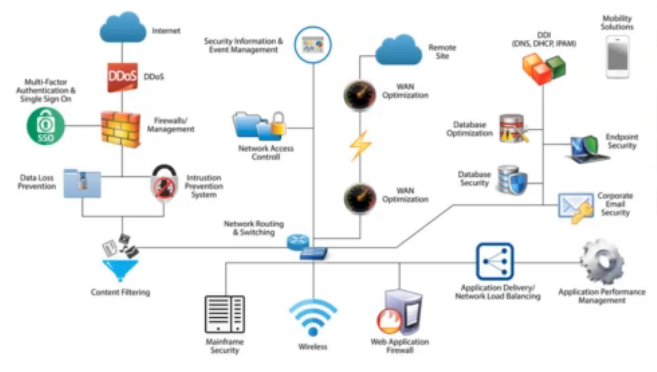

# Content
- SDLC (Software Development Life Cycle)
- Security
- Introdution to OWASP Top 10 [2021]

## SDLC (Software Development Life Cycle)

- Requirement Analysis
     
    Build out requirements for what it is that you are going to develop
     
  - High level view of requirements and goals
  - Extracts requirements or requirements analysis
  - Clients have an idea of what they want - not how
  - Scope defined and agreed with
  - Prioritization of requirements
  - Slotting of resources

- Design
     
    Make your decisions around Technology and how it is going to actually be designed, what it is going to look like
     
  - Describe features and operations
    - Screen layout
    - Business rules
    - Procress diagrams
    - Pseudo code and documentation

  - Prototype work
  - Detailed design
    - Technology choices
    - System architecture

- Implementation
     
    Coding phase in SDLC, then you start testing and there is going to be some evolution

  - Input (Requirements and Design)
    - Requirements
    - Business Process
    - Business Rules
    - Software Design
    - Specification

  - Output
    - Deliverable Code

- Testing
     
    Testing phase in SDLC

  - Static Analysis (Code testing)
  - Dynamic Analysis (Running software testing)
  - Unit testing (Verify the functionality of specific code)
  - Integration testing (Verify the interfaces between components)
  - Interface testing (Testing data passed between units)
  - System testing (Testing a completely integrated system)

- Evolution
     
    Do some learnings from what you have built and put that into the requirements again to make enhancements to the development product that you have created

    Patch, Build, Test, Prod:
     
    You want to make sure that if there is any issues found such as security or even just defects, you want to patch those issues then rebuild, retest and then push it to production

## Security

Security is anything you do to protect an <u>asset</u> that is <u>vulnerable</u> to some <u>attack</u>, <u>failure</u>, or <u>error</u> [threats]

- **Asset**
     
    An **asset** is anything you deem to have **value**
     
    An asset may be valuable because:
  - It <u>holds</u> its value (E.g. gold/diamonds)
  - It <u>produces</u> value (E.g. Technology space, a server in a data center - running applications produce value to organization)
  - It <u>provides access</u> to value (E.g. a PIN number to a bank account to get money - something that needs to be protected)

- **Vulnerability**
     
    A vulnerability is any weakness in an asset that makes it susceptible to attack of failure

- **Attack**
     
    An attack is any <u>intentional</u> action that can reduce the value of an asset
     
    E.g. An attacker might perform a DDoS attack on that web server to reduce value for organisation intentionally

- **Failures + Errors**
     
    Failures and errors are <u>unintentional</u> actions that can reduce the value of an asset
     
    E.g. There might be an unplanned outage because of a power outage or maybe a new push for a patch that gets pushed at web server that does not work that creates an outage for that web server, making it unavailable for organisation so it reduce value unintentionally

Attacks, Failures and Errors are actions that we collectively refer to as <u>threats</u>

### Security Goals ("Anything")

Security, an more specifically Cybersecurity, can be understood as a set of goals

These goals are specifically defined by how we measure an asset's value

How does value define our security goals?

- The goal of security is to protect an asset's <u>value</u> from threats

1. Determine what assets we want to protect
2. Learn how the asset works and interacts with other things
3. Determine how our asset's value is reduced directly and indirectly
4. Take steps to mitigate the threats

We must consider the unique nature of it assets and capabilities when considering security goals.

#### CIA prinicples

When we protect something that provides access value, we are maintaining its confidentiality

- **Confidentiality**
     
    Information is only available to those who should have access (we can do this through encryption and HTTPS when we talking about browser traffic)

When we protect something that holds its value, we are maintaining its integrity

- **Integrity**
     
    Data is known to be correct and trusted (we can do this through hashing, checksum, sometimes digital signatures)

When we protect something that produces value, we are maintaining its availability

- **Availability**
     
    Information is available for use by legitimate users when it is needed (we can do this through building high availability and redundancy into our system)

**Real World Example**

- About a rocket
  - List assets
         
        (identifies what is actually on the rocket)
         
        Rocket itself, the food, the fuel, the water, the payload that is within the rocket, the equipment, the manifest, etc.

  - List vulnerabiltiies
         
        (possible vulnerabilties that impact rocket)
         
        A weak heat shield, faulty equipment, the hole could be too thin, etc.

  - List threats
         
        (attacks, failures, errors that impact rocket)
         
        Space debris, atmosphere, weather, pilot error, etc.

- How we secure it
     
    Based on the list of vulnerabilties and threats, we can have different ways that we could mitigate it.
     
    For instance, we could make the hole thicker or with using more duarble material. However, that could also alter things in the sense that we might make the rocket heavier and therefore, we would need more fuel to get it up or we could have less cargo space.
     
    Hence, the concept is making sure that the mitigations and the security that we put around our assets are in line with what the actual assets value is and make sure that we're not compromising the asset further by creating more complicated mitigations or remediation strategies.

We have well defined goals and security mechanisms, but some mechanisms are better because they fit <u>security principles</u>

Security principles aid in selecting or designing the correct mechanisms to implement our goals

Protection of information in computer systems [Doc]
 
https://web.mit.edu/Saltzer/www/publications/protection/

OWASP WebGoat
 
https://owasp.org/www-project-webgoat/

## Introduction to OWASP Top 10 [2021]

**1. Broken Access Control**
 
Restrictions on what authenticated users are allowed to do are often not properly enforced. Attackers can exploit these flaws to access unauthorized functionality and/or data, such as access other user's accounts, view sensitive files, modify other users' data, change access rights, etc.

**2. Cryptographic Failures**
 
Failure to sufficiently protect data in transit or rest from exposure to unauthorized individuals. This can include poor usage of encryption or the lack of encryption all together.

**3. Injection**
 
Injection flaws, such as SQL, NoSQL, OS, and LDAP injection, occur when untrusted data is sent to an interpreter as part of a command or query. The attacker's hostile data can trick the interpreter into executing unintended commands or accessing data without proper authorization.

**4. Insecure Design**
 
Failing to build security into the application early in the design process through a process of threat modeling, and secure design patterns and principles.

**5. Security Misconfiguration**
 
Security misconfiguration is the most commonly seen issue. This is commonly a result of insecure default configurations, incomplete or ad hoc configurations, open cloud storage, misconfigurated HTTP headers, and verbose error messages containing sensitive information. Not only must all operating systems, frameworks, libraries, and applications be securely configured, but they must be patched/upgraded in a timely fashion.

**6. Vulnerable and Outdated Components**
 
Components, such as libraries, frameworks, and other software modules, run with the same privileges as the application. If a vulnerable component is exploited, such an attack can facilitate serious data loss or server takeover. Applications and APIs using components with known vulnerabilities may undermine application defenses and enable various attacks and impacts.

**7. Identification and Authentication Failure**
 
Application functions related to authentication and session management are often implemented incorrectly, allowing attackers to compromise passwords, keys, or session tokens, ot to exploit other implementation flaws to assume other users' identities temporarily or permanently.

**8. Software and Data Integrity Failures**
 
Code or infrastructure that does not properly protect against integrity failures like using plugins from untrusted sources that can lead to a compromise.

**9. Insufficient Logging and Monitoring Failures**
 
Insufficient logging and monitoring, coupled with missing or ineffective integration with incident response, allows attackers to further attack systems, maintain persistence, pivot to more systems, and tamper, extract, or destroy data. Most breach studies show time to detect a breach is over 200 days, typically detected by external parties rather than internal processes or monitoring.

**10. Server-Side Request Forgery**
 
SSRF occurs when an application fetches resources without validating the destination URL. This can be taken advantage of by an attacker who is able to enter a destination of their choosing.

### OWASP Help

OWASP offers that are great hints and series and frameworks that can be leveraged during the development process and all throughout the testing, the application testing and development process.

### OWASP Projects

- **Flagship**
 
The OWASP Flagship destination is given to projects that have demonstrated strategic value to OWASP and application security as a whole
 

- **Lab**
 
OWASP Labs projects represent projects that have produced a deliverable of value
 

- **Incubator**
 
OWASP Incubator projects represent the experimental playground where projects are still being fleshed out, ideas are still being proven and development is still underway
 

- **Low Activity**
 
These projects had no release in at least a year. However, have shown to be valuable tools Code [Low Activity] Health Check February 2016

### How to start with OWASP

OWASP Top 10: the classic guideline
 
https://owasp.org/www-project-top-ten/

OWASP Cheat Sheets to get into stuff without getting annoyed
 
https://github.com/OWASP/CheatSheetSeries

Tools:

- Security Shephard
 
https://github.com/OWASP/SecurityShephard

- WebGoat
 
https://owasp.org/www-project-webgoat/

- OWASP Juice Shop
 
https://owasp.org/www-project-juice-shop/

- OWASP ZAP (Zed Attack Proxy)
 
<https://www.zaproxy.org/>

- OWTF (Offensive Web Testing Framework)
 
<https://owasp.org/www-project-owtf/>

- OWASP ASVS
 
<https://owasp.org/www-project-application-security-verification-standard/>

- Secure Coding Practices Quick Reference Guide
 
<https://owasp.org/www-project-secure-coding-practices-quick-reference-guide/>

- Java HTML Sanitizer
 
<https://owasp.org/www-project-java-html-sanitizer/>

- CSRF Guard Project
 
<https://owasp.org/www-project-csrfguard/>

- ESAPI
 
<https://owasp.org/www-project-enterprise-security-api/>

- Developers Guide
 
<https://owasp.org/www-project-secure-coding-practices-quick-reference-guide/>

- Security Knowledge Framework
 
<https://owasp.org/www-project-security-knowledge-framework/>

- OWASP Testing Guide
 
<https://owasp.org/www-project-web-security-testing-guide/>

- Code Review Guidelines
 
<https://owasp.org/www-project-code-reviews-guide/>

- Dependency Check
 
<https://owasp.org/www-project-dependency-check/>

- Dependency Track
 
<https://owasp.org/www-project-dependency-track/>

- DefectDojo
 
<https://owasp.org/www-project-defectdojo/>

### SANS 25

<https://www.sans.org/top25-software-errors/>

**Examples in the Top 25**

.PNG)

### OWASP vs SANS

### Threat Actors and Definition

- **Confidentiality**
 
Concept of preventing the disclosure of information to unauthorized parties
 

- **Integrity**
 
Refers to protecting data from unauthorized alteration
 

- **Availability**
 
Access to systems by authorized personnel can be expressed as the system's availability
 

- **Authentication**
 
Authentication is the process of determining the identity of a user
 

- **Authorization**
 
Authorization is the process of applying access control rules to a user process, determining whether or not a particular user process can access an object
 

- **Accounting (Audit)**
 
Accounting is a means of measuring activity
 

- **Non-Repudiation**
 
Non-Repudiation is the concept of preventing a subject from denying a previous action with an object in a system
 

- **Least Privilege**
 
Subject should have only the necessary rights and privileges to perform its current task with no additional rights and privileges
 

- **Separation of Duties**
 
Ensures that for any given task, more than one individual needs to be involved
 

- **Defense in Depth**
 
Defense in depth is also known by the terms layered security (or defense) and diversity defense
 

- **Fail Safe**
 
When a system experiences a failure, it should fail to a safe state (Doors open when there is a power failure)
 

- **Fail Secure**
 
The default state is locked or secured. So a fail secure lock locks the door when power is removed.
 

- **Single point of failure**
 
A single point of failure is any aspect of a system that, if it fails, the entire system 

#### Types of attackers

- **Script Kiddies**
  - Low skill
  - Looking for easy and simple attacks
  - Motivated by revenge or fame

- **Hacktivist**
  - Moderate to high skill
  - Looking to make an example of an organisation
  - Motivated by activism

- **Hackers**
  - High skill
  - Looking to understand how things work
  - Motivation varies

- **Cyber Criminals**
  - High skill
  - Looking for financial exploits
  - Motivated money (Ransomware, Cryptojacking)

- **Advanced Persistent Threat**
  - Very high skill, deep pockets
  - Looking to commit cyber attacks in order to weaken a political advesary
  - Driven largely by national interest

#### Defense effort against threat actors

### Identifying Vulnerabilities
- **CVE (Common Vulnerabilities and Exposure)**
https://cve.mitre.org/cve/

  - Common Vulnerabiltiies and Exposures is a list of common identifiers for publicly known cyber security vulnerabiltiies
  
    - One identifier for one vulnerability with one standardized description
    - A dictionary rather than a database
    - The way to interoperability and better security coverage
    - A basis for evaluation among services, tools and database
    - Industry-endorsed via the CVE Numbering Authorities, CVE Board, and numerous products and services that include CV

- **CVSS (Common Vulnerability Scoring System)**
https://nvd.nist.gov/vuln-metrics/cvss

  - Common Vulnerability Scoring Sytem provides a way to capture the principal characteristics of a vulnerability and produce a numerical score reflecting its severity. The numerial score can then be translated into a qualitative representation (such as low, medium, high, and critical) to help organisations properly assess and prioritize their vulnerability management processes
   
    - Calcuating a score
      https://www.first.org/cvss/calculator/3.0 

    - Example CVE with a CVSS score
      https://www.nvd.nist.gov/vuln/detail/CVE-2017-14977

- **CWE (Common Weakness Enumeration)**
https://cwe.mitre.org/

  - Common Weakness Enumeration is a community-developed list of common software security weaknesses. It serves as a common language, a measuring stick for software security tools, and as a baseline for weakness identification, mitigation, and prevent efforts
  
  - As its core, the Common Weakness Enumeration is a list of software weaknesses types
  
  - Three types:
    - **Research**
      This view is intended to facilitate research into weaknesses, including their inter-dependencies and their role in vulnerabilities

    - **Development**
      This view organizes weaknesses around concepts that are frequently used or encountered in software development

    - **Architecture**
      This view organizes weaknesses according to common architectural security tactics

### Defense of depth
**Exploitation** of a **vulnerability** by a **threat** results in **risk**.

**Anatomy of an attack**
- Vulnerability: Adobe Flash CVE-2016-0960
- Exploit: Code written to take advantage of the vulnerability
- Payload: Ransomware, Trojan, RAT, keylogger, etc.

**Defense in depth** is an approach to cybersecurity in which a series of defensive mechanisms are layered in order to protect valuable data and information. If one mechanism fails, another setps up immediately to thwart an attack.

**What does it look like in the Cyber World**

- Do not rely on defense in depth to always protect your app
- Systems fail they can be circumvented by the weakest link
- Your app may not always be behind those defenses

### Proxy Tools
In normal web interaction between a client and an application, there is a HTTP request and response.

Your application is expecting requests to come in from a client. And the client could be a browser/mobile app/API which is going to make a request to your application and it is going to hit the web server.

Depending on what your application is and how its architecture is built, it is going to take that request and process it and return a response.

So this request and response interaction between the client and application is an HTTPS communication.

Hence, what a proxy does, where proxy tool does, is that it sits between your browser and the web server and will actually proxy or capture that traffic and before ift is sent to the web server. This gives you the ability to see what the request is and what that request looks like before it goes to web server and what that response from the web server is coming back (able to capture both the request and response - acts as an intermediary between browser and web server)

Different tools:
- https://www.charlesproxy.com/
- https://www.telerik.com/fiddler
- https://httptoolkit.tech/
- Browser "Developer Tools"

### API Security
**Application Programming Interfaces (APIs)** allow the creation of discrete functionality that is available through a function or HTTP call to the functionality.

This allows for a modular approach to building an overall application.

For instance, JavaScript has APIs available that are built on top of the base language that allow the developer to integrate additional functionality:
- **Browser APIs**
Built into the browser, these expose data from the browser and environment that the browser is running in

- **3rd Party APIs**
These are APIs that are pulled in from external sources that allow you to retrieve data and functionality from that 3rd party 

**Difference between APIs and Standard application**

#### OWASP API Security Top 10
| Broken object level authorization | Mass assignment |
| :---:            |     :---:      |
| Broken authentication | Security misconfiguration  |
| Excessive data exposure | Injection  |
| Lack of resource and rate limiting | Improper assets management  |
| Broken function level authorization | Insufficient logging and monitoring  |

##### Broken Object Level Authorization
-  **Definition**
 
Attacker substitutes ID of their resource in API call with an ID of a resource belonging to another user. Lack of proper authorization checks allows access. This attack is also known as IDOR (Insecure Direct Object Reference)

- **Example**
 
An API that allows for an attacker to replace parameters in the URL that allows the attackers to have access to an API that they should not have access to. The API is not checking permissions and lets the call through.

- **Prevention**
  - Implement access checks on every call
  - Do not rely on user supplied IDs, only use IDs in the session object
  - Use random, non-guessable IDs

##### Broken Authentication
-  **Definition**
 
Poorly implemented API authentication allowing attackers to assume other users' identities.

- **Example**
 
Unprotected APIs, weak authentication, not rotating or reusing API keys, poor password usage, lack of token validation and weak handling

- **Prevention**
  - Check all authentication methods and use standard authentication, token generation/management, password storage, and MFA
  - Implement a strong password reset API
  - Authenticate the client calls to API
  - Use rate-limitations to avoid brute forcing

##### Excessive Data Exposure
-  **Definition**
 
API exposing a lot more data than the client legitimately needs, relying on the client to do the filtering. Attacker goes directly to the API and has it all.

- **Example**
 
Returning full data objects from the database or allowing for direct access to sensitive data.

- **Prevention**
  - Never rely on the client to filter data, and tailor API responses to the needs of the consumer. Ensure that there is a need-to-know for any PII returned
  - Ensure error responses do not expose sensitive information

##### Lack of Resource and Rate Limiting
-  **Definition**
 
API is not protected against an excessive amount of calls or payload sizes. Attackers use that for DoS and brute force attacks.

- **Example**
 
Attacker performs a DDoS or otherwise overwhelms the API.

- **Prevention**
  - Include rate limting, payload size limits, check compression ratios, and limit container resources

##### Broken Function Level Authorization
-  **Definition**
 
API relies on client to use user level or admin level APIs. Attacker figures out the "hidden" admin API methods and invokes them directly.

- **Example**
 
Administrative functions that are exposed to non-admin users.

- **Prevention**
  - Deny all access by default and build permissions from there based on specific roles
  - Test authorization through tools and manual testing

##### Mass Assignment
-  **Definition**
 
The API takes data that client provides and stores it without proper filtering for allow-listed properties.

- **Example**
 
Payload received from the client is blindly transformed into an object and stored.

- **Prevention**
  - Do not automatically bind incoming data without validating it first through an explicit list of parameters and payloads that you are expecting
  - Use a readOnly schema for properties that should never be modified
  - Enforce the defined schemas, types, and patterns that are accepted

##### Security Misconfiguration
-  **Definition**
 
Poor configuration of the APIs servers allows attackers to exploit them.

- **Example**
 
Numerous issues like unpatched systems, overexposed files and directories, missing or outdated configuration, exposed systems and unused features, verbose error messaging.

- **Prevention**
  - Use of hardened images and secure default configuration
  - Automation to detect (and repair) discovered misconfiguration
  - Disable unnecessary features, and limit admin access

##### Injection
-  **Definition**
 
Attacker constructs API calls that include SQL-, NoSQL-, LDAP-, OS- and other commands that the API or backend behind it blindly executes.

- **Example**
 
SQL, LDAP, OS, XML injection

- **Prevention**
  - Never trust end-user input
  - Have well-defined input data: schemas, types, string patters, etc.
  - Validate, filter, sanitize and quarantine (if needed) data from users

##### Improper Assets Management
-  **Definition**
 
Attacker finds non-production versions of the API: such as staging, testing, beta or earlier versions - that are not as well protected and uses those to launch the attack.

- **Example**
 
Backwards compatibility can leave legacy systems exposed. Old and non-production versions can be poorly maintained yet still have access to production data. These also allow for lateral movement in the system.

- **Prevention**
  - Properly inventory your systems and APIs
  - Limit access to anything that should not be public and properly segregate prod and non-prod environments
  - Implement security controls on the network and system such as API firewalls
  - Have a decommission process for old APIs and systems

##### Insufficent Logging and Monitoring
-  **Definition**
 
Lack of proper logging, monitoring, and alerting let attacks go unnoticed.

- **Example**
 
Logging and alerts go unnoticed or are not responded to. Logs are not protected against tampering and are not integrated into a centralized logging system like a SIEM.

- **Prevention**
  - Properly log sensitive workflows like failed login attempts, input validation failures, and failures in security policy checks
  - Ensure logs are formatted so that they can be imported in a centralized tool. Logs also need to be protected from tampering and exposure to unauthorized users
  - Integrate logs with monitoring and alerting tools

### Dive into OWASP Top 10

#### Broken Access Control
https://owasp.org/Top10/A01_2021-Broken_Access_Control/

- Authorization is the process where requests to access a resource should be granted or denied. It should be noted that authorization is not equivalent to authentication - as these terms and their definitions are frequently confused

- **Authentication** is providing and validating identity

- **Authorization** includes the execution rules that determines what functionality and data the user (or Principal) may access, ensuring the proper allocation of access rights after authentication is successful

- Having a license does not mean you are granted access to a military base. You have authentication, but not authorization

- **Access Control**
  
  
- **Common Vulnerabiltiies**
  - Violation of the principle of least privilege or deny by default, where access should only be granted for particular capabilities, roles, or users, but is available to anyone
  - Bypassing access control checks by modifying URL internal application state, or the HTML page, or simply using a custom API attack tool
  - Permitting viewing or editing someone else's account, by providing its unique idenitifier (insecure direct object references)
  - Accessing APIs that do not have proper access controls around HTTP verbs (PUT, POST, DELETE)
  - Elvation of privilege. Acting as a user without being logged in, or acting as an admin when logged in as a user
  - Metadata manipulation, such as replaying or tampering with a JSON Web Token (JWT) access control token or a cookie or hidden field manipulated to elevate privileges, or abusing JWT invalidation
  - CORS misconfiguration allows unauthorized API access
  - Force browsing to authenticated pages as an unauthenticated user or to privileged pages as a standard user. Accessing API with missing access controls for POST, PUT, and DELETE

- **Prevention**
  - Apart from public resources, deny by default
  - Implement access control mechanisms once and re-use them throughout the application, including minimizing CORS usage
  - Model access controls should enforce record ownership, rather than accepting that the user can create, read, update or delete any record
  - Disable web server directory listing and ensure file metadata (e.g. git) and backup files are not present within web roots
  - Log access control failures, alert admins when appropriate (e.g. repeated failures)
  - Rate limit API and controller access to minimize the harm from automated attack tooling
  - JWT tokens should be invalidated on the server after logout

- **Example 1**
  - The application uses unverified data in a SQL call that is accessing account information:
  <pre>
    <code>
      pstmt.setString(I, request.getParameter("acct"));
      ResultSet results = pstmt.executeQuery();
    </code>
  </pre>  
  - An attacker simply modifies the 'acct' parameter in the browser to send whatever account number they want. If not properly verified, the attacker can access any user's account (http://example.com/app/accountInfo?acct=notmyacct)

- **Example 2**
  - An attacker simply forces browser to target URLs. Admin rights are required for access to the admin page
  <pre>
    <code>
      http://example.com/app/getappInfo
      http://example.com/app/admin_getappInfo
    </code>
  </pre>
  - If an unauthenticated user can access either page, its a flaw. If a non-admin can access the admin page, this is a flaw

#### Cryptographic Failures
https://owasp.org/Top10/A02_2021-Cryptographic_Failures/

- **Data Protection**
  - **Protected Health Information (PHI)**
     
    Names, Dates, Phone/Fax Numbers, Email, SSN, MRN, Account Numbers, Biometric (finger, retinal, voice prints), Images 
  
  - **Personally Identifiable Information (PII)**
     
    Name, Address, Passport, Vehicle information, Drivers license, Credit card numbers, Digital identity, birthplace, genetic information, login name

  - **Sensitive Financial Information**
     
    Credit/Debit card numbers and security codes, Account numbers, loan agreements, loan details, Tax ID, PoS transactions

- **Cryptographic Failures**  
  

- **Defense**
  .PNG)

- **Example**
  - A site does not use or enforce TLS for all pages or supports weak encryption. An attacker monitors network traffic (e.g. at an insecure wireless network), downgrades connections from HTTPS to HTTP, intercepts requests and steals the user's session cookie. The attcker then replays this cookie and hijacks the user's (authenticated) session, accessing or modifying the user's private data. Instead of the above, they could alter all transported data (e.g. the recipient of a money transfer)

#### Injection
https://owasp.org/Top10/A03_2021-Injection/

- **Injection**
Anytime user input changes the intended behaviour of the system

- **How does it happen**
  - Trust of user input without validating, filtering, or sanitizing
  - Dynamic queries are used directly in an interpreter without escaping
  - Extracting additional information from by taking advantage weaknesses in search parameters used in object-relational mapping
  - Using input directly in a SQL command that is used for queries or commands

- **SQL Injection**
  - Allows attackers to manipulate SQL statements sent to a database from the web applicaiton
  - Exploits inadequate validation and sanitization of user-supplied input
  
- **SQL Injection Potential Impact**
  - Steal all data from the database
  - Access PII/PHI/PCI Data
  - Take over backend server or entire network
  - Remove data

- **Example (SQLI)**
An application uses untrusted data in the construction of the following vulnerable SQL call:
<pre>
  <code>
    String query = "SELECT \* FROM accounts WHERE custID = " + request.getParameter("id") + "";
  </code>
</pre>

Similarly, an application's blind trust in frameworks may result in queries that are still vulnerable (e.g. Hibernate Query Language (HQL))
<pre>
  <code>
    Query HQLQuery = session.createQuery("FROM accounts WHERE custID=" + request.getParamter("id") + "");
  </code>
</pre>

In both cases, the attacker modifies the "id" parameter value in their browser to send: ' or 'I'='I

For instance: http://example.com/app/accountView?id=' or 'I'='I

This changes the meaning of both queries to return all the records from the accounts table. More dangerous attacks could modify or delete data or even invoke stored procedures

- **Other Injection Flaws**
  - **OS Command**
    
     
    .PNG)
  - **LDAP**
    
  - **XPATH**
    

- **Example**
  - http://example/defaul.aspx?user=*
  - In the example above, we send the * character in the user parameter which will result in the filter variable in the code to be initialized with (samAccountName=*)
  - The resulting LDAP statement will make the server return any object that contains the samAccountName attribute. In addition, the attacker can specify other attributes to search for and the page will return an object matching the query

- **Prevention**
  - Utilize a parametrized interface to the database
  - Positive server-side input validation (e.g. allow-list of valid input)
  - Escape special characters in the query flow
  - Limit the return of records in a query using SQL controls like LIMIT (record count)

#### Insecure Design
https://owasp.org/Top10/A04_2021-Insecure_Design/

- **Insecure Design**
  - Insecure design happens when we do not use secure design patterns 
  - Often thought of as security requirements/reference architecture when we do not have a paved road methodology (essentially placing secure guardrails around the development and deployment of application) that also leads us to insecure design
  - When we are not doing threat modeling (allows us identify threats and risks early on in the process and build in those requirements into the design early on), that also leads to insecure design

- **How to Prevent**
  - Establish and use a secure development lifecycle with AppSec professionals to help evaluate and design security and privacy-related controls
  - Establish and use a library of secure design patterns or paved road ready to use components
  - Use threat modeling for critical authentication, access control, business logic, and key flows
  - Integrate security language and controls into user stories
  - Integrate plausibility checks at each tier of your application (from frontend to backend)
  - Write unit and integration tests to validate that all critical flows are resistant to the threat model. Compile use-cases and misuse-cases for each tier of your application
  - Segregate tier layers on the system and network layers depending on the exposure and protection needs
  - Segregate tenants robustly by design throughout all tiers
  - Limit resource consumption by user or service

- **Defences**
  - Use a secure development lifecycle with security professionals for guidance
  - Create secure design patterns and architectures that can be reused to create a paved road
  - Threat model critical application workflows
  - Write secure unit and integration tests that use abuse and misuse cases
  - Design for segregation of tenants

- **Bad Bots**
  - A retail chain's e-commerce website does not have protection against bots run by scalpers buying high-end video cards to resell auction websites. This creates terrible publicity for the video card makers and retail chain owners and enduring bad blood with enthusiasts who cannot obtain these cards at any price. Careful anti-bot design and domain logic rules, such as purchases made within a few seconds of availability, might identify inauthentic purchases and rejected such transactions

#### Security Misconfiguration
https://owasp.org/Top10/A05_2021-Security_Misconfiguration/

- **Absence of security settings in**
  - Application
  - Framework
  - Database
  - Web server
  - Platform

- **Lack of**
  - Patching
  - Secure settings for parsers
  - Outdated security configuration
  - Default settings/passwords
  - Overly verbose messaging when an error occurs
  - Out of date software

- **Defences**
  - Hardened secure defaults that are used to deploy in other environments in an automated method. Each environment should be configured identically with the same security controls
  - Reduce the extra features and frameworks that are not needed for used
  - Use a change management board to verify changes to environments and provide a gate for significant changes
  - Segment components and use automated tools to verify configuration and detect drift

- **Default settings in the cloud**
  - A cloud service provider (CSP) has default sharing permissions open to the Internet by other CSP users. This allows sensitive data stored within cloud storage to be accessed

#### Using Known Vulnerable Components
https://owasp.org/Top10/A06_2021-Vulnerable_and_Outdated_Components/

- **Dependency**
  - Dependency is a broad software engineering term used to refer when a piece of software relies on another one
  
  

- **Vulnerable and Outdated Components**
  - The term "Components" in the title of this category refers to application frameworks, libraries or other software modules integrated into an application: such components are usually written by a 3rd Party but this is not exclusive
  - This category references using these components when they may have malicious code or security weaknesses within them (e.g. vulnerable)

- **Defences - Commercial**
  - Most applications include either commercial products or Open Source Software (OSS) within their software bundles
  - For commercial products, most major vendors such as Oracle, Google and IBM provide Security Bulletins to distribution lists for notification purposes. Make sure you are signed up for these services
  
- **Defences - Open Source Software**
  - For Open Source Software (OSS) libraries find a solution like Dependency Check, GitLab, or Jfrong, Xray, to automatically scan for vulnerable packages
  - Sign-up for regular security bulletins from the National Vulnerability Database (https://nvd.nist.gov/Home/Email-List) and regularly monitor components for security issues and updated versions

- **General Defence**
  - Do not give extreme trust in any 3rd party component
  - Always verify its size and checksum and download directly from vendor website, never a secondary party
  - Challenge the vendor to provide evidence of security vulnerability scanning. If possible, scan it yourself
  - Use well-known vendors and sources that are maintained 
  - Remove unnecessary components from your code if they are not in use

- **Example**
  - Components typically run with the same privileges as the application itself, so flaws in any component can result in serious impact. Such flaws can be accidental (e.g. coding error) or intentional (e.g. a backdoor in a component) 
  - Some example exploitable component vulnerabilities discovered are:
    - CVE-2017-5638, a Struts 2 remote code execution vulnerability that enables the execution of arbitary code on the server, has been blamed for significant breaches
    - While the Internet of Things (IoT) is frequently difficult or impossible to patch, the importance of patching them can be great (e.g. biomedical devices)
  - There are automated tools to help attackers find unpatched or misconfigured systems. For example, the Shodan IoT search engine can help you find devices that still suffer from HeartBleed vulnerability patched in April 2014

- **Notification**
  - Have a means for receiving notifications on potentially vulnerable software
  - Many vendors like Microsoft already offer a notification service, however other services or feeds exist
  - Receiving notification is only part of the solution. You must also be able to:
    - Know where to patch (what systems or software are vulnerable)
    - Have the ability to test the new patch
    - Have a means to deliver the patch
    - Ability to notify those impacted by the changes to the system (users, customers, etc)
  
- **Patching Process**

#### Identification and Authentication Failures
https://owasp.org/Top10/A07_2021-Vulnerable_and_Outdated_Components/

- **How can Authentication be broken**

- **Attacks**
  - Password guessing attack (social engineering)
    - John from IT, needs your help ...
  - Dictionary attack
    - Dictionary words that are hashed and tested
  - Brute force attack
    - Guessing or targeted hashes
  - Username enumeration
    - Guessable patterns of usernames or log in failure messages that reveal too much
  - Phishing
    - Trick users into providing their credentials to an imposter, look-alike site

- **Account Recovery Risks**
  - Social Engineeing
    - Emailing a password reset form without using something like two factor
  - Easily guessable security answers
    - "What school did you attend"
  - Password sent through insecure channels
    - Email
  - Password change not required
    - Once you have been given a new password, it should be changed on the next login

#### Software and Data Integrity Failures
https://owasp.org/Top10/A08_2021-Software_and_Data_Integrity_Failures/

- **Software Integrity Failures**

- **Software Integrity Prevention**

- **Example**
  - SolarWinds malicious update: Nation-states have been known to attack update mechanisms, with a recent notable attack being the SolarWinds Orion attack. The company that develops the software had secure build and update integrity processes. Still, these were able to be subverted, and for several months, the firm distributed a highly targeted malicious update to more than 18,000 organisations, of which around 100 or so were affected. This is one of the most far-reaching and most significant breaches of this nature in history

#### Security Logging and Monitoring Failures
https://owasp.org/Top10/A09_2021-Security_Logging_and_Monitoring_Failures/

- **Security Logging and Monitoring Failures**
  - Exploitation of insufficient logging and monitoring is the bedrock of nearly every major incident. Attackers rely on the lack of monitoring and timely response to achieve their goals without being detected
  - Most successful attacks start with vulnerability probing. Allowing such probes to continue can raise the likelihood of successful exploit to nearly 100%
  - Between October 1, 2020, through December 31, 2021, the median number of days between compromise and detection was 21, down from 24 days in 2020 (itbrew.com)
    - In 2016, identifying a breach took an average of 191 days
  - Insufficient logging, detection, monitoring and active response occurs any time:
    - Auditable events, such as logins, failed logins, and high-value transactions are not logged
    - Warnings and errors generate no, inadequate or unclear log messages
    - Logs of applications and APIs are not monitored for suspicious activity or logs are only stored locally
    - Appropriate alerting thresholds and response escalation processes are not in place or effective
    - Penetration testing and scans by DAST tools (such as OWASP ZAP) do not trigger alerts
    - The application is unable to detect, escalate, or alert for active attacks in real time or near real time
    - Plans for monitoring, and response should be developed and well known to the organisation

- **Good Practices**
  - As per the risk of the data stored or processed by the application:
    - Ensure all login, access control failures, and server-side input validation failures can be logged with sufficient user context to identify suspicious or malicious accounts, and held for sufficient time to allow delayed forensic analysis
    - Ensure that logs are generated in a format that can be easily consumed by a centralized log management solutions
    - Ensure high-value transactions have an audit trail with integrity controls to prevent tampering or deletion, such as append-only database tables or similar
    - Establish effective monitoring and alerting such that suspicious activities are detected and responded to in a timely fashion
    - Establish or adopt an incident response and recovery plan

- **SIEM (Security Information and Event Management)**

#### Server-Side Request Forgery (SSRF)
https://owasp.org/Top10/A10_2021-Server-Side_Request_Forgery/

- **SSRF occurs when we do not**

- **Defenses**
  - From Network Layer
    - Segment remote resource access functionality in separate networks to reduce the impact of SSRF
    - Enforce "deny by default" firewall policies or network access control rules to block all but essential intranet traffic

  - From Application Layer
    - Sanitize and validate all client-supplied input data
    - Enforce the URL schema, port, and destination with a positive allow list
    - Do not send raw responses to clients
    - Disable HTTP redirections
    - Be aware of the URL consistency to avoid attacks such as DNS rebinding and "time of check, time of use" (TOCTOU) race conditions

- **Example**
  - Sensitive data exposure
    - Attackers can access local files or internal services to gain sensitive information such as file:///etc/passwd and http://localhost:28017/

  - Compromise internal services
    - The attacker can abuse internal services to conduct further attacks such as Remote Code Execution (RCE) or Denial of Service (Do)